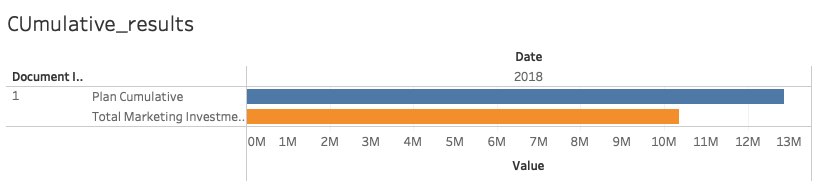
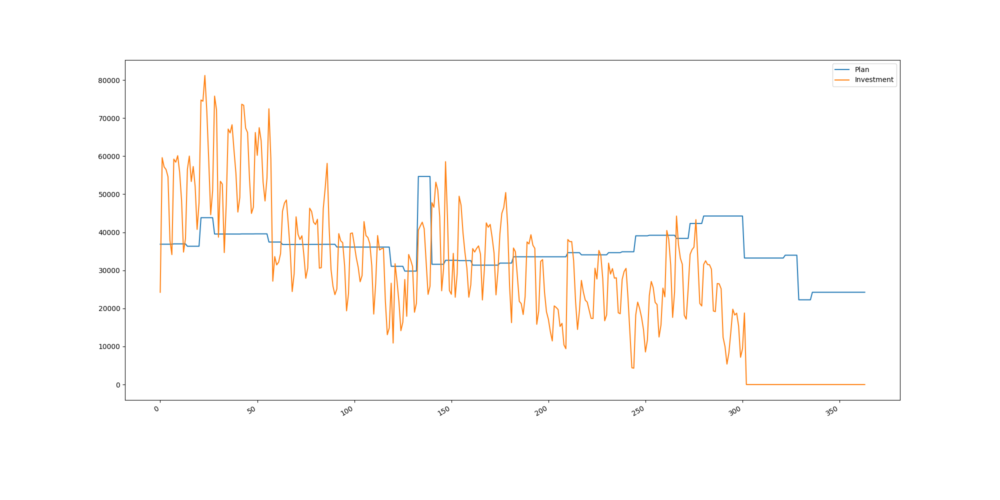

# Vyhodnoceni kapane


> Načtěte data z plánu a postbuy. 

source: `1_open_files.py`

> Spočítejte, kolik procent z celkového rozpočtu je vyčerpáno.

source: `2_count_final_budget.py`
```
Total plan result is: 12872796
Total marketing investment is: 10347066
```
Vycerpano je **80 %** z celkoveho rozpoctu.


> Spočítejte, kde jsme aktuálně časově v procentech, když počáteční datum PLANU? je 0% a koncové datum je 100%.

source: `3_Plan_in_time.py`
```
Broadcasted total : 302
Not broadcasted total : 62
```
Podil odvysilanych kampani je **83 %** z celkoveho rozpoctu.

>	Zobrazte grafem porovnání plánované (součet hodnot Impressions_Client, Clicks_Client a Views_Client) a realizované investice (MarketingInvestment) po dnech. Graf bude tedy obsahovat 2 datové řady, viz obrázek níže.

source: `4_Planned_Realized.py`


> Zobrazte grafem tyto 2 hodnoty kumulovaně. Tato vizualizace ukazuje jestli naše celková investice k dnešnímu dni je v souladu s celkovou plánovanou investicí k dnešnímu dni.

`nesplneno`

> Zobrazte poměr mezi kumulovaným plánem a kumulovaným postbuy k datu poslední aktualizace (tzn. tam, kde máme poslední data z postbuye).

`nesplneno`
